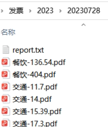

对于一组按照特定规则命名的pdf发票，获取最近接目标金额的发票组合，并按照类别分类统计


将发票pdf命名为 分类-金额.pdf 的格式，运行calc.py，选择pdf所在目录，输入目标金额，将输出分类统计的结果。

如果选择将发票组合移入子目录，将会创建当天日期命名的子目录，并将符合目标金额的发票组合移入其中，并生成分类统计报告



### report.txt
```
交通: 1042.62 (14 files)
食品: 916.89 (2 files)
餐饮: 540.54 (2 files)
Total: 2500.05 (18 files)
Total ch: 贰伍零零.零伍
```